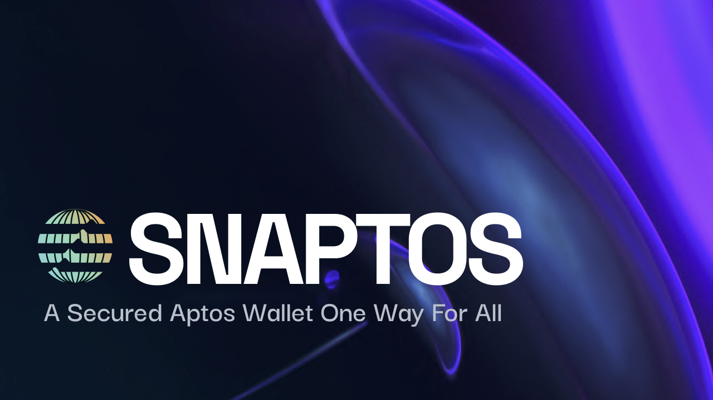
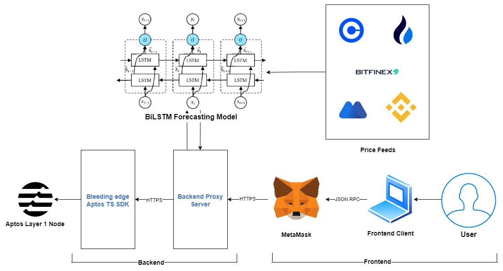

# Snaptos Wallet



Welcome to Snaptos Wallet, a Metamask Snap that brings support for the non-EVM L1 blockchain, Aptos. This feature-rich wallet is designed to provide users with a seamless experience for managing Aptos assets, executing transactions, and accessing various advanced functionalities, all within the familiar Metamask environment.

## Features

### 1. Aptos Asset Management
Easily store, send, and receive Aptos cryptocurrency within the Metamask Snap. Snaptos ensures a secure and efficient way to manage your Aptos assets without leaving the Metamask ecosystem.

### 2. Faucet for Testing and Development
Accelerate your development process with our built-in faucet. Obtain test and dev Aptos instantly for debugging and testing purposes, ensuring a smooth development experience.

### 3. Gas Estimation
No more guesswork! Aptos Wallet provides accurate gas estimation for transactions, allowing users to make informed decisions and optimize their transaction costs.

### 4. Transaction Log
Keep track of your transactions effortlessly. The transaction log provides a comprehensive overview of your Aptos transactions, enhancing transparency and accountability.

### 5. Real-time APT to USD Conversion
Stay updated with real-time Aptos to USD conversion rates directly within the wallet. This feature ensures users are always aware of the current value of their Aptos holdings.

### 6. On-chain Account Creation
Create Aptos accounts directly on-chain with just a few clicks. Aptos Wallet simplifies the account creation process, providing a single interface for all your account management needs.

### 7. Advanced APT to USD prediction model
Aptos Wallet leverages a sophisticated Bidirectional LSTM model to predict the future value of Aptos in USD. This feature provides users with a reliable and accurate forecast of Aptos price movements.

## How to Get Started

1. **Clone the Repository.**
2. **Install Dependencies:**
   ```bash
   yarn install
   ```
3. **Start the Server:**
   ```bash
   cd server
   yarn install
   yarn start
   ```
4. **Return to the Root Directory:**
   ```bash
   cd ..
   ```
5. **Start the Forecasting Engine**

   Make sure you have Docker installed. If not, please follow the instructions [here](https://docs.docker.com/get-docker/).
   ```bash
   cd forecaster
   cd bin
   chmod +x deploy.sh
   ./deploy.sh up
   ```
5. **Start the Application**
   ```bash
   cd ..
   yarn start
   ```

Congratulations! You are now ready to experience the power of Snaptos. Access your Aptos assets, leverage advanced features, and enjoy a streamlined user experience right within the Metamask Snap.

## Notations

- **Gas Estimation:** Our sophisticated algorithm analyzes the current network conditions to provide accurate gas estimates, ensuring optimal transaction execution.

- **Real-time APT to USD Conversion:** The conversion rates are sourced from reputable APIs, offering users a reliable and up-to-date valuation of their Aptos holdings.

- **On-chain Account Creation:** Behind the scenes, Aptos Wallet leverages smart contract interactions to securely and efficiently create Aptos accounts directly on-chain.

## Solution Architecture

The main components of the solution are:
- **Metamask Snap:** The Metamask Snap is a browser extension that allows users to interact with the Aptos blockchain. It is a lightweight extension of the Metamask browser extension and is built using Typescript. The Metamask Snap is responsible for generating the Aptos wallet keypair using the seed phrase associated with ethereum. It uses metamask's [`snap_getBip32Entropy`](https://docs.metamask.io/snaps/reference/rpc-api/#snap_getbip32entropy) method to generate the `rootNode` by using the derive path `[m, 44', 637']` and uses this to derive the keypair using the [SLIP algorithm](https://github.com/satoshilabs/slips/blob/master/slip-0010.md). It also stores the key pair in the secure storage provided by metamask, so that on subsequent logins with the password, it can be fetched directly. The snap also acts as the interface through which operations like coin transfer, faucet funding, viewing transaction history, etc can be done.

- **Proxy backend server:** As Metamask Snaps operate in a sandboxed environment, they are not able to make requests to external APIs. Thus, we have created a proxy backend server that acts as a bridge between the snap and the external APIs. The snap makes requests to the proxy server, which then forwards the request to the external API and returns the response back to the snap. The proxy server is built using Node.js and Express.js in Typescript. It also acts as the interface between the snap and the forecasting engine. The proxy server uses the cutting-edge [aptos-ts-sdk](https://github.com/aptos-labs/aptos-ts-sdk) to interact with the Aptos blockchain. The proxy server performs important functionalities like faucet funding, coin transfer, transaction history, account balance etc. It also provides the snap with real time APT to USD conversion rates by making requests to multiple coin feeds (discussed below).

   Snap and the proxy server interact with each other as explained in the below UML diagram:

   

- **BiLSTM Forecasting Model:** The forecasting engine is built using a Bidirectional LSTM(Long Short Term Memory) model, which is trained on historical data to predict future Aptos price movements. We have trained the model on more than 500 continuous data points which we scraped ourselves from the internet through multiple sources/price feeds. The different data feeds we used are:
   - Binance: https://www.binance.com/api/v3/ticker/price?symbol=APTUSDT
   - Bitfinex: https://api-pub.bitfinex.com/v2/tickers?symbols=tAPTUSD
   - Coinbase: https://api.coinbase.com/v2/prices/APT-USD/spot
   - Huobi: https://api.huobi.pro/market/detail/merged?symbol=aptusdt
   - Mexc: https://www.mexc.com/open/api/v2/market/ticker?symbol=APT_USDT

   A sample code to ping these APIs at regular intervals for price data is given in [data_collection.py](./additional/data_collection.py).

   The values these feeds provide can be combined with different individual weights, but here we have give all a equal weight of 1. 

   The various model hyperparameters of the BiLSTM are:
   - **Number of LSTM layers:** 1
   - **Optimizer:** Adam
   - **Loss function:** Mean Squared Error
   - **Number of epochs:** 100
   - **Batch size:** 9
   - **Learning rate:** 0.001
   - **Lookback period:** 16 time units

   The model is written using the [Pytorch](https://pytorch.org/) library to implement the complex neural architecture described above. When trained, the model gives us a training error of 0.01 and a validation error in the range of 0.01 to 0.03 (MSE Loss), which is a very good score for time series prediction datasets.

   The entire forcasting model is dockerized to avoid installing all the libraries manually and thus provides a fast and convenient way to deploy the solution.
- **Frontend Client:** The frontend client is built using React.js and Typescript. It is responsible for providing the user with a seamless and intuitive experience. It shows the account address, user's balance, and provides the user with the option to transfer Aptos to other accounts. It is responsible for fetching the real time APT to USD conversion rates from the proxy server and displaying it to the user along with forecasting data. It also fetches the transaction history from the proxy server, provides the user with the option to create an Aptos account on-chain, allows switching between mainnet, testnet and devnet, and also provides the user with the option to fund their account with test and dev Aptos using the faucet. 

## Why LSTM?
- Given the highly volatile nature of the crypto market, we need a model that can capture the non-linearities and complexities of the data. Simple statistical algorithms like ARIMA and SARIMA are not suitable for this task as they are not able to capture the non-linearities and complexities of the data. CNNs, RNNs and their variations have proved to be very effective in forecasting complex time series data. We have used LSTM as it is a very powerful variation of RNNs and is able to capture long term dependencies in the data. We have used a Bidirectional LSTM as it is able to capture the dependencies in both the directions of the time series data.
- Although RNNs and CNNs were meant for time series data, they usually falter at remembering long term dependencies in the data. LSTMs and GRUs were made to overcome this limitation and thus here we have used LSTMs, which are a superior version of RNNs.

## Demo

https://github.com/aritroCoder/Snaptos/assets/95216822/aef48482-29df-4ceb-9dd1-dfdb8b6608ea

## Authors
This project has been made for 12th Inter IIT Tech meet 2023 by Insitute/Team id 46. It will be made open source under the MIT License after the competition ends.

## References
- Patel, Mohil Maheshkumar, et al. "A deep learning-based cryptocurrency price prediction scheme for financial institutions." Journal of information security and applications 55 (2020): 102583. https://doi.org/10.1002/isaf.1488
- Khedr, Ahmed M., et al. "Cryptocurrency price prediction using traditional statistical and machine‐learning techniques: A survey." Intelligent Systems in Accounting, Finance and Management 28.1 (2021): 3-34. https://doi.org/10.1002/isaf.1488
- Pintelas, E., Livieris, I.E., Stavroyiannis, S., Kotsilieris, T., Pintelas, P. (2020). Investigating the Problem of Cryptocurrency Price Prediction: A Deep Learning Approach. In: Maglogiannis, I., Iliadis, L., Pimenidis, E. (eds) Artificial Intelligence Applications and Innovations. AIAI 2020. IFIP Advances in Information and Communication Technology, vol 584. Springer, Cham. https://doi.org/10.1007/978-3-030-49186-4_9
